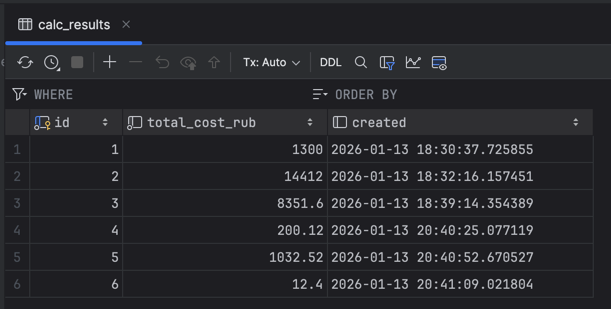
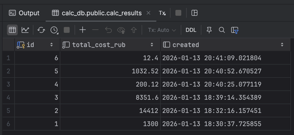

# Сервис расчета стоимости материалов

## Описание
Этот проект представляет собой веб-сервис на FastAPI для расчета общей стоимости материалов. Сервис принимает список материалов с их количеством и ценой, вычисляет общую стоимость и сохраняет результаты в базе данных.

## Функциональность
- Расчет общей стоимости материалов на основе их количества и цены
- Сохранение результатов расчетов в базе данных
- REST API для взаимодействия с сервисом

## Технологии
- **FastAPI**: современный веб-фреймворк для создания API
- **SQLAlchemy**: ORM для работы с базой данных
- **Pydantic**: валидация данных и сериализация
- **Docker**: контейнеризация приложения

## Структура проекта
```
├── src/
│   ├── api/            # API эндпоинты
│   ├── db/             # Модели и настройки базы данных
│   ├── schemas/        # Pydantic модели для валидации данных
│   ├── services/       # Бизнес-логика
│   └── main.py         # Точка входа в приложение
├── Dockerfile          # Файл для сборки Docker образа
├── docker-compose.yml  # Конфигурация для Docker Compose
└── requirements.txt    # Зависимости проекта
```

## Запуск проекта
### С использованием Docker
```bash
docker-compose up -d
```

### Локальный запуск
1. Установите зависимости:
```bash
pip install -r requirements.txt
```

2. Запустите приложение:
```bash
python -m src.main
```

## API
### Расчет стоимости материалов
**Endpoint**: POST /calc

**Пример запроса**:
```json
{
  "materials": [
    {
      "name": "Дерево",
      "qty": 5,
      "price_rub": 100
    },
    {
      "name": "Металл",
      "qty": 2,
      "price_rub": 200
    }
  ]
}
```

**Пример ответа**:
```json
{
  "total_cost_rub": 900
}
```

## Database

### SQL-запрос, который возвращает 10 последних расчётов отсортированных по дате
```sql
SELECT * FROM calc_results
ORDER BY created DESC
LIMIT 10
```

#### Пример содержания таблицы `calc_results`


#### Пример выполнения SQL-запроса:
